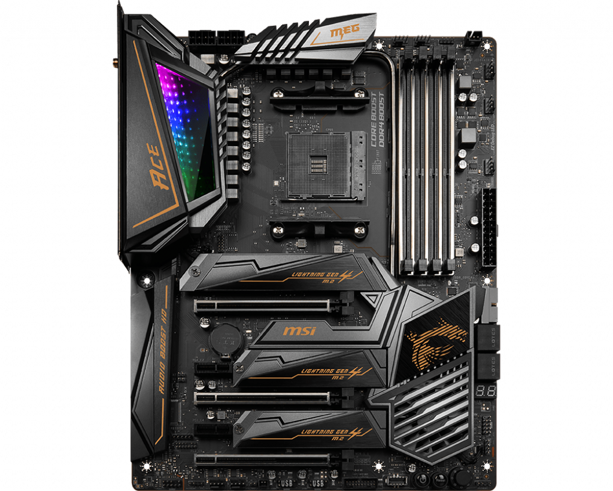
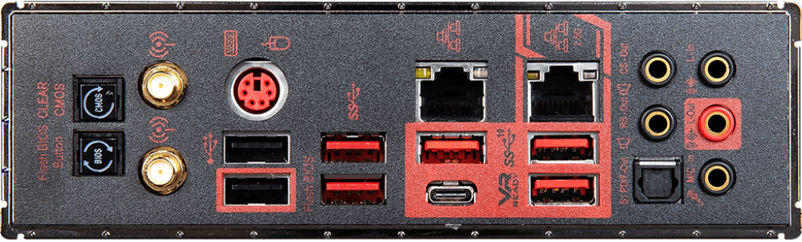

# AMD-MSI-MEG-X570-ACE-Hackintosh  
## Hackintosh EFI config files for MSI MEG X570 ACE  

[Guide Used - OpenCore Vanilla](https://khronokernel-2.gitbook.io/opencore-vanilla-desktop-guide/)

### MEMORY  
	Up to 128GB works, all motherboard supported dims work

See [MSI support page](https://www.msi.com/Motherboard/support/MEG-X570-ACE#support-mem-19)

### AMD® X570 Chipset  
	4x SATA 6Gb/s ports - Works  
	2x M.2 slots - Works  
	1x M.2 slot - Works  

### RAID - Not supported  

### AMD® Processor - Works  

### AUDIO  
	Realtek® ALC1220 Codec
	7.1-Channel High Definition Audio - Works
	Supports Optical S/PDIF output - Works
	
### LAN  
	1x Intel® WGI211AT Gigabit LAN controller - Works 
	1x Realtek® RTL8125 2.5 Gbps LAN controller - No driver in MacOS - Works 
	
### WIFI & BLUETOOTH - Dont work, separate wifi card needed  
	Intel® Wi-Fi 6 AX200 - Not supported 

### INTERNAL CONNECTORS - Works  
	4x SATA 6Gb/s connectors - Works
	2x USB 2.0 connectors (support additional 4 USB 2.0 ports) - Works
	2x USB 3.2 Gen 1 connectors (support additional 4 USB 3.2 Gen 1 ports) - Works
	1x USB 3.2 Gen 2 Type-C Port - Not supported
	1x Front panel audio connector - Works
	1x TPM module connector - Not supported
	

### BACK PANEL PORTS  
	Clear CMOS Button - Works 
	Wi-Fi /Bluetooth Antenna Connectors - Not supported 
	PS/2 GAMING Device Port - Not supported
	REALTEK 2.5G + Intel Gigabit LAN - Not supported + Works 
	HD Audio Connectors - Works 
	Flash BIOS Button - Works 
	USB 2.0 Ports - Works 
	USB 3.2 Gen1 Ports - Works 
	USB 3.2 Gen2 Ports Type A+C - Works 
	USB 3.2 Gen2 Ports  - Works 

### OPERATING SYSTEM  
	Mac OS Catelina - Works 
	
### OTHER  
	Virtualisation - Not supported 

[a System Report for all connected hardware](./Mac Pro_SystemReport.spx)
