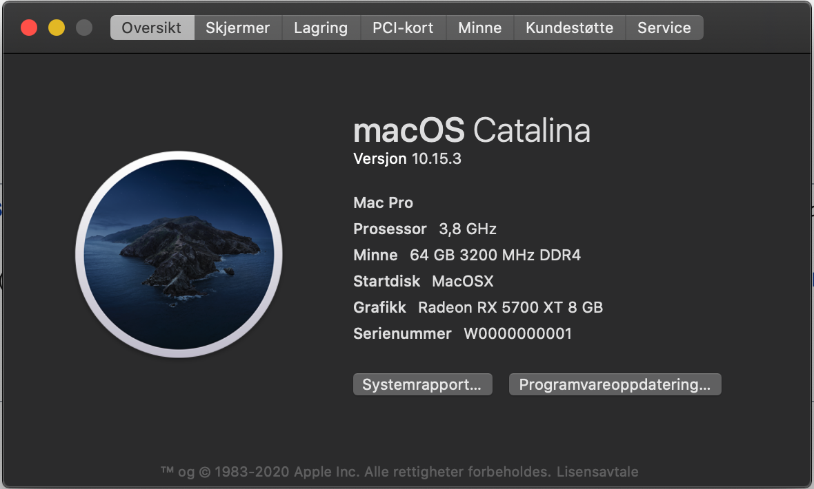

# AMD-MSI-MEG-X570-ACE-Hackintosh
Hackintosh EFI config files for MSI MEG X570 ACE

MEMORY - Up to 128GB works, all motherboard supported dims work

AMD® X570 Chipset
	4x SATA 6Gb/s ports - Works
	2x M.2 slots - Works
	1x M.2 slot - Works

RAID - Not supported
USB - Works
AMD® X570 Chipset - Works
	3x USB 3.2 Gen2 (SuperSpeed USB 10Gbps) ports (2 Type-A ports on the back panel, 1 Type-C internal connector)
	4x USB 3.2 Gen1 (SuperSpeed USB) ports through the internal USB 3.2 Gen1 connectors
	6x USB 2.0 (High-speed USB) ports (2 Type-A ports on the back panel, 4 ports through the internal USB 2.0 connectors)
AMD® Processor - Works
	2x USB 3.2 Gen2 (3rd Gen AMD Ryzen™) or USB 3.2 Gen1 (2nd Gen AMD Ryzen™/ Ryzen™ with Radeon™ Vega Graphics and 2nd Gen AMD Ryzen™ with Radeon™ Graphics) ports (1x Type-A & 1x Type-C) on the back panel
	2x USB 3.2 Gen1 (SuperSpeed USB) Type-A ports on the back panel
AUDIO - Works 
Realtek® ALC1220 Codec
	7.1-Channel High Definition Audio
	Supports Optical S/PDIF output
LAN - Partly works
	1x Intel® WGI211AT Gigabit LAN controller
	1x Realtek® RTL8125 2.5 Gbps LAN controller - No driver in MacOS
WIFI & BLUETOOTH - Dont work, separate wifi card needed
Intel® Wi-Fi 6 AX200 - Not supported
	Supports 802.11 a/b/g/n/ac/ax, MU-MINO Rx, 2.4GHz-5GHz (160MHz) up to 2.4Gbps
	Supports Bluetooth® 5
	The Wireless module is pre-install in the M2_4 (Key-E) slot

INTERNAL CONNECTORS - Works
	4x SATA 6Gb/s connectors - Works
	2x USB 2.0 connectors (support additional 4 USB 2.0 ports) - Works
	2x USB 3.2 Gen 1 connectors (support additional 4 USB 3.2 Gen 1 ports) - Works
	1x USB 3.2 Gen 2 Type-C Port - Not supported
	1x Front panel audio connector - Works
	1x TPM module connector - Not supported 

BACK PANEL PORTS
Clear CMOS Button - Works
Wi-Fi /Bluetooth Antenna Connectors - Not supported 
PS/2 GAMING Device Port - Not supported
REALTEK 2.5G + Intel Gigabit LAN - Not supported + Works
HD Audio Connectors - Works
Flash BIOS Button - Works
USB 2.0 Ports - Works
USB 3.2 Gen1 Ports - Works
USB 3.2 Gen2 Ports Type A+C - Works
USB 3.2 Gen2 Ports  - Works

OPERATING SYSTEM
Mac OS Catelina

Format: 
